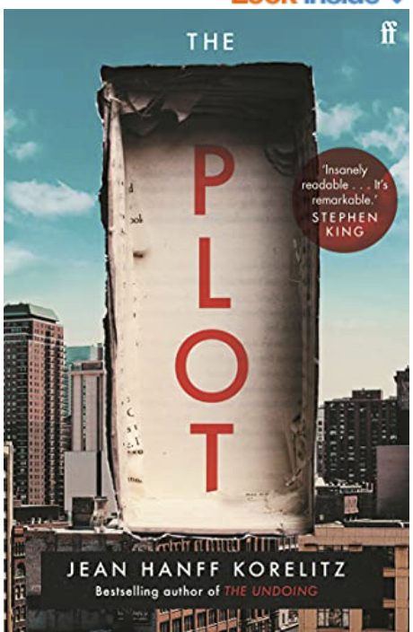

---
title: "Data visualisation in R"
author: "Catherine Hurley"
date: "7/9/2021"
output:
  html_document:
    theme: readable
    code_download: true
    toc: true
    toc_depth: 2
    number_sections: true
    pandoc_args: ["--number-offset=1"]
editor_options: 
  chunk_output_type: console
  
---

<!-- <style type="text/css"> -->
<!--   body, td { -->
<!--     font-size: 14pt; -->
<!--   } -->
<!-- code.r{ -->
<!--   font-size: 12pt; -->
<!-- } -->
<!-- pre { -->
<!--   font-size: 12pt -->
<!-- } -->
<!-- </style> -->


```{r setup, include=FALSE}
knitr::opts_chunk$set(echo = TRUE, message=FALSE, warning=F)
```
# Part II Advanced displays

## Preparation

You will find the material for this lecture at <https://github.com/cbhurley/CRT2021vis>

First install these packages

```{r, eval=F}
install.packages(c("GGally", "ISLR2", "naniar"))
```

and load with

```{r}
library(GGally)
library(ISLR2)
library(timetk) # for the data
library(palmerpenguins)
library(tidyverse)
library(naniar)

bike <- bike_sharing_daily
bike$season <- c("Winter","Spring", "Summer","Fall")[bike$season]
bike$season <- factor(bike$season, levels = c("Winter","Spring", "Summer","Fall"))  

bike$mnth <- factor(bike$mnth)

bike$holiday <- factor(c("No","Yes")[bike$holiday+1])
bike$workingday <- factor(c("No","Yes")[bike$workingday+1])

bike$yr <- factor(c("2011","2012")[bike$yr+1])

bike$weathersit <- c("clear", "cloudy", "lightP", "heavyP")[bike$weathersit]
bike$weathersit <- factor(bike$weathersit, levels= c("clear", "cloudy", "lightP", "heavyP"))
bike <- droplevels(bike)
```


## Big data

ISLR2 has an hourly version of the bike data with 8645  observations.

The plot of registered versuscasual users is

```{r,  fig.width=4.5, fig.height=4, fig.align="center"}
ggplot(data=Bikeshare, aes(x=casual, y=registered)) + geom_point()
```

There is likely lot of overplotting.

Jittering will randomly undo rounding, and using alpha will help too

```{r,  fig.width=4.5, fig.height=4, fig.align="center"}
ggplot(data=Bikeshare, aes(x=casual, y=registered)) + 
  geom_jitter(alpha=.5, size=.5)
```

Other options are to form 2d bins, count the number of observations in each, and color in
proportion to the frequency.

```{r,  fig.width=5, fig.height=4, fig.align="center"}
p <- ggplot(data=Bikeshare, aes(x=casual, y=registered))
p+ geom_bin2d()
```

I prefer to make my colour scale light to dark:
```{r,  fig.width=5, fig.height=4, fig.align="center"}
p +  
  geom_bin2d() +
  scale_fill_gradient(low = "lightblue1", high = "steelblue4")

p +  
  geom_bin2d() +
  scale_fill_gradient(low = "lightblue1", high = "steelblue4" ,trans="log10")
```

The second plot takes a log of the counts so you get a better spread of colours

```{r,  fig.width=5, fig.height=4, fig.align="center"}
p +  
  stat_binhex() +
  scale_fill_gradient(low = "lightblue1", high = "steelblue4" ,trans="log10")
```
`stat_binhex` uses hexagonal binning

 A more advanced plot fits a 2d density estimate and draw this as a contour plot.
 
```{r,  fig.width=5, fig.height=4, fig.align="center"} 
p + stat_density2d()
```  
```{r,  fig.width=5, fig.height=4, fig.align="center", eval=F} 
# fills in the contours
p + stat_density2d(aes(fill = after_stat(level)), geom = "polygon") 
```    

## Scatterplot matrix

Back to the smaller dataset.

Go to articles tab for info
<https://ggobi.github.io/ggally/>


```{r, fig.width=4.5, fig.height=4, fig.align="center"}
library(GGally)
ggpairs(bike, columns=c("casual","registered","cnt" ))
```

You can change what is plotted on lower, upper and diagonal,using
`lower=` etc.
Putting in `mapping=` gives densities for both years separately


```{r, fig.width=4.5, fig.height=4, fig.align="center"}

  
ggpairs(bike, mapping = aes(color = yr),
            columns=c("casual","registered","cnt" ),
  lower = list(continuous =  wrap("smooth", method="lm", se=F, alpha=.5)),
  diag = list(continuous = wrap("densityDiag", alpha=0.5 )))

```


`ggpairs` can handle factors as well.
In this plot `yrs` is in as a plot variable, and as colour.

```{r, fig.width=4.5, fig.height=4, fig.align="center"}


ggpairs(bike, mapping = aes(color = yr),
        columns=c("casual","registered","cnt","yr"),
        lower = list(continuous =  wrap("smooth", method="lm", se=F, alpha=.5)),
        diag = list(continuous = wrap("densityDiag", alpha=0.5 )))
 
```

## Parallel coordinates

Construction:

```{r, fig.width=6, fig.height=3, fig.align="center"}

s <- sample(nrow(bike),20)
ggparcoord(bike[s,], columns=match(c("casual","registered","cnt"),names(bike)),
           groupColumn = "yr",
           showPoints=TRUE,
           alphaLines=0)

ggparcoord(bike[s,], columns=match(c("casual","registered","cnt"),names(bike)),
           groupColumn = "yr",
           showPoints=TRUE,
           alphaLines=1)

ggparcoord(bike[s,], columns=match(c("casual","registered","cnt"),names(bike)),
           groupColumn = "yr")
```

By default, all variables are scaled to mean zero and standard deviation 1, individually.
Variables that are positively correlated will have parallel line segments, here registered and cnt.

Other scaling options are:

```{r, fig.width=6, fig.height=3, fig.align="center"}

ggparcoord(bike[s,], columns=match(c("casual","registered","cnt"),names(bike)),
           groupColumn = "yr", scale="uniminmax")
ggparcoord(bike[s,], columns=match(c("casual","registered","cnt"),names(bike)),
           groupColumn = "yr", scale="globalminmax")

```
In globalminmax, no scaling is done. Here you can see that most users per day are registered.

To see what certain patterns look like in a parallel coordinate plot, let
us look at some fake data

```{r, fig.width=6, fig.height=3, fig.align="center"}

x <- rnorm(100)
y <- x+ .3*rnorm(100)
z <- -y+ .1*rnorm(100)
w <- -z+ .5*rnorm(100)
ggparcoord(data.frame(x,y,z,w), scale="uniminmax")
```

Positive correlation exhibits as parallel segments.

Negative correlation has crossing. The stronger the negative correlation the smaller the pinch point.


```{r,fig.width=6, fig.height=3, fig.align="center"}
ggparcoord(bike, columns=match(c("casual","registered","cnt"),names(bike)),
           groupColumn = "workingday",
           alphaLines=.4)
```

In the above we see that there is a difference in the casual-registered association for workingday or not.
Both groups have positive association but slopes are different.
There are more casual users at the weekend.

Verifying with a scatterplot

```{r,  fig.width=5, fig.height=4, fig.align="center"}
ggplot(data=bike, aes(x=casual, y=registered, color=workingday)) + geom_point()
```

The same pattern was evident in the full bike data.


## Practice 3

Using the `penguins` dataset, make this plot

```{r, fig.width=6, fig.height=5, fig.align="center", echo=F}
ggpairs(na.omit(penguins), mapping = aes(color = species),
            columns=c(3:7),
  lower = list(continuous =  wrap("smooth", method="lm", se=F, alpha=.5)),
  diag = list(continuous = wrap("densityDiag", alpha=0.5 )))
```
Which pair of variables and species has the highest correlation?

Can you find two variables with negative correlation, but positive correlation within each species?
This is called Simpson's paradox.

Using `ggparcoord`, plot all the numeric variables. Use species as color.

Can you identify presence of positive and negative correlation?


```{r,fig.width=6, fig.height=3, fig.align="center", echo=F, eval=F}


ggparcoord(penguins, columns=which(sapply(penguins, is.numeric)),
           groupColumn = "species",
           alphaLines=.4)

ggparcoord(penguins, columns=which(sapply(penguins, is.numeric)),
           groupColumn = "island",
           alphaLines=.4)

ggparcoord(penguins, columns=which(sapply(penguins, is.numeric)),
           groupColumn = "sex",
           alphaLines=.4)

```

## Missing data

Here we use package naniar.
This is the dataset for your assignment. All the NAs are marked in grey.

```{r,fig.align="center"}
m <- read_csv("marathon.csv",na=c(""," ","NA"))
vis_miss(m)
```

An upset plot shows the combination of missing values.
Most of the NAs involve the club variable.

```{r,fig.align="center"}
gg_miss_upset(m[,-c(22,20)])
```

Check out the visualisations in `naniar` for more options, eg the vignette at <https://cran.r-project.org/web/packages/naniar/vignettes/naniar-visualisation.html>

## Recommended book

"The plot", Jean Hanff Korelitz

```{r, echo=F, eval=T, out.width="25%", fig.align='center'}

```

```{r, echo=FALSE, eval=FALSE, purl=FALSE}
knitr::purl("lect2.Rmd")

```


